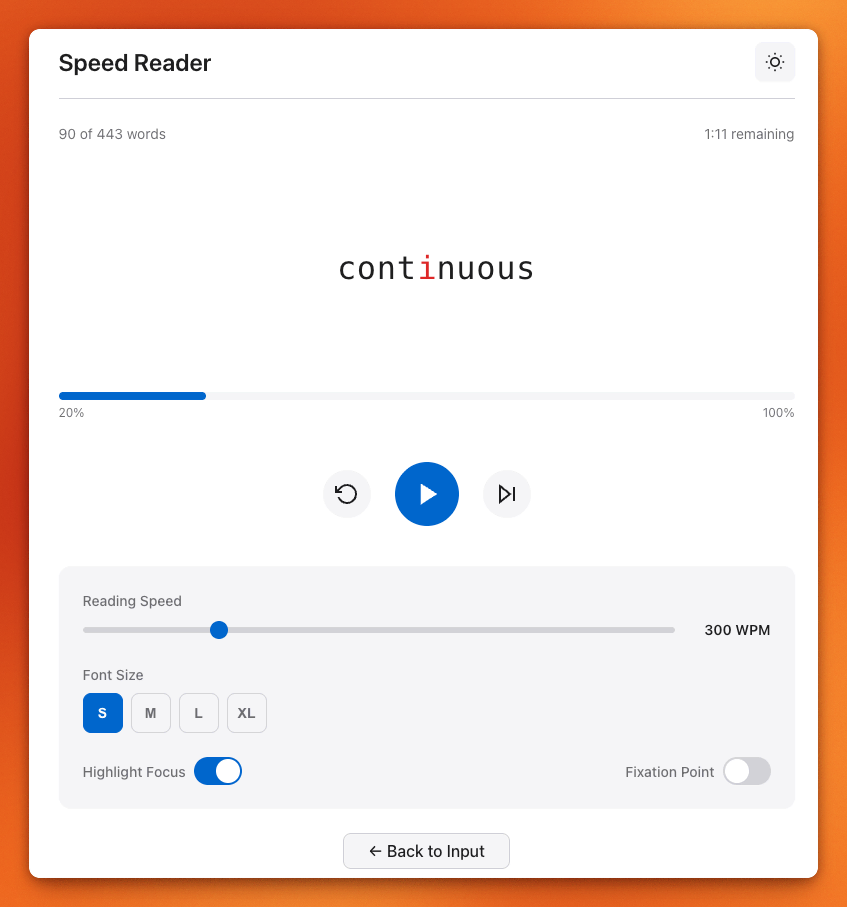

# Speed Reader

A lightweight RSVP (Rapid Serial Visual Presentation) speed reading Progressive Web App built with vanilla HTML, CSS, and JavaScript.



## Features

- **RSVP Speed Reading**: Words displayed one at a time at a fixed focal point
- **ORP Highlighting**: Middle letter highlighted for optimal recognition
- **Adjustable Speed**: 100-1000 WPM with real-time adjustment
- **Punctuation Delays**: Automatic pauses after sentences and clauses
- **Progress Tracking**: Visual progress bar with time remaining
- **Dark/Light Mode**: Automatic system detection + manual toggle
- **Responsive Design**: Works on mobile, tablet, and desktop
- **PWA Support**: Installable, works offline
- **Keyboard Shortcuts**: Space (play/pause), R (restart), E (end), Esc (back)

## Getting Started

### Local Development

1. Clone the repository
2. Serve the files with any static server:

```bash
# Using Python
python -m http.server 8000

# Using Node.js (npx)
npx serve

# Using PHP
php -S localhost:8000
```

3. Open `http://localhost:8000` in your browser

### Usage

1. Paste or type text into the input area
2. Click "Start Reading"
3. Use controls to play/pause, restart, or skip to end
4. Adjust speed and font size in the settings panel

## Keyboard Shortcuts

| Key | Action |
|-----|--------|
| `Space` | Play/Pause |
| `R` or `Home` | Restart |
| `E` or `End` | Go to end |
| `Escape` | Back to input |

## Settings

- **Reading Speed**: 100-1000 WPM (default: 300)
- **Font Size**: Small, Medium, Large, X-Large
- **Highlight Focus**: Toggle ORP letter highlighting
- **Fixation Point**: Toggle center line marker

## Browser Support

- Chrome (latest)
- Firefox (latest)
- Safari (latest)
- Edge (latest)

## License

MIT
